# 📱 WGA Brasil - Manual do Usuário

> **Sistema de Gerenciamento de Visitas Técnicas**
> Versão 1.3.0

---

## 📑 Índice

1. [Introdução](#introdução)
2. [Primeiro Uso e Configuração Inicial](#primeiro-uso-e-configuração-inicial)
3. [Acesso ao Sistema](#acesso-ao-sistema)
4. [Dashboard](#dashboard)
5. [Visitas Técnicas](#visitas-técnicas)
6. [Detalhes da Visita](#detalhes-da-visita)
7. [Clientes](#clientes)
8. [Equipamentos](#equipamentos)
9. [Testes/Ensaios](#testesensaios)
10. [Produtos](#produtos)
11. [Templates de Observação](#templates-de-observação)
12. [Configuração de IA](#configuração-de-ia)
13. [Gerenciamento de Usuários](#gerenciamento-de-usuários)
14. [Meu Perfil](#meu-perfil)

---

## 📖 Introdução

O **WGA Brasil** é um sistema completo para gerenciamento de visitas técnicas de tratamento de água. Ele permite:

- ✅ Registrar visitas e leituras em campo
- ✅ Controlar dosagens de produtos químicos
- ✅ Tirar e anexar fotos
- ✅ Gerar relatórios automáticos com IA
- ✅ Enviar relatórios por email
- ✅ Salvar relatórios no Google Drive
- ✅ Gerenciar estoque de produtos por cliente

---

## 🚀 Primeiro Uso e Configuração Inicial

> ⚠️ **Importante:** O sistema possui dependências funcionais entre os cadastros. Siga a ordem abaixo para evitar problemas.

### Ordem de Configuração

Para que o sistema funcione corretamente, os cadastros devem ser feitos **nesta ordem**:

```
┌─────────────────────────────────────────────────────────────────┐
│  1. TESTES          →  Definir os ensaios/análises que serão    │
│                        realizados (pH, Cloro, Condutividade...) │
├─────────────────────────────────────────────────────────────────┤
│  2. PRODUTOS        →  Cadastrar produtos químicos que serão    │
│                        dosados (Biocida, Antiincrustante...)    │
├─────────────────────────────────────────────────────────────────┤
│  3. EQUIPAMENTOS    →  Criar tipos de equipamentos e associar   │
│                        os testes e produtos padrão              │
├─────────────────────────────────────────────────────────────────┤
│  4. CLIENTES        →  Cadastrar os clientes                    │
├─────────────────────────────────────────────────────────────────┤
│  5. LOCAIS          →  Criar locais/unidades dentro do cliente  │
├─────────────────────────────────────────────────────────────────┤
│  6. EQUIPAMENTOS    →  Adicionar equipamentos em cada local     │
│     NO LOCAL           do cliente                               │
├─────────────────────────────────────────────────────────────────┤
│  7. VISITAS         →  Agora você pode criar visitas técnicas!  │
└─────────────────────────────────────────────────────────────────┘
```

### Dependências Funcionais

| Para fazer...  | Você precisa antes ter... |
|----------------|---------------------------|
| Registrar **leituras** em uma visita | Equipamentos com testes associados no local |
| Registrar **dosagens** em uma visita | Equipamentos com produtos associados no local |
| Criar **visita** para um cliente | Cliente com pelo menos um local cadastrado |
| Adicionar **equipamento** no local | Tipo de equipamento cadastrado |
| Associar **teste** a equipamento | Teste cadastrado em Cadastros > Testes |
| Associar **produto** a equipamento | Produto cadastrado em Cadastros > Produtos |
| Controlar **estoque** do cliente | Produto cadastrado e adicionado ao estoque do cliente |

### Guia Rápido: Primeira Configuração

**Passo 1:** Cadastrar Testes
1. Vá em **Cadastros** > **Testes**
2. Cadastre os testes que você realiza (ex: pH, Condutividade, Cloro Livre)
3. Defina as faixas ideais e limites críticos

**Passo 2:** Cadastrar Produtos
1. Vá em **Cadastros** > **Produtos**
2. Cadastre os produtos químicos (ex: Biocida, Antiincrustante)

**Passo 3:** Criar Tipos de Equipamentos
1. Vá em **Cadastros** > **Equipamentos**
2. Crie tipos como "Torre de Resfriamento", "Caldeira"
3. Associe os testes e produtos padrão a cada tipo

**Passo 4:** Cadastrar Cliente
1. Vá em **Cadastros** > **Clientes**
2. Adicione o cliente com nome, email, telefone

**Passo 5:** Criar Local no Cliente
1. Dentro do cliente, clique em **+ Adicionar Local**
2. Dê um nome (ex: "Matriz", "Torre 1")

**Passo 6:** Adicionar Equipamentos no Local
1. Selecione o local do cliente
2. Clique em **+ Adicionar Equipamento**
3. Escolha o tipo (os testes/produtos serão herdados)
4. Personalize os testes/produtos se necessário

**Passo 7:** Pronto! Criar Visita
1. Vá em **Visitas** > **+ Nova Visita**
2. Selecione o cliente e data
3. Os equipamentos e testes aparecerão automaticamente

> 💡 **Dica:** Se os testes ou dosagens não aparecem em uma visita, verifique se o equipamento do local tem testes/produtos associados.

---

## 🔐 Acesso ao Sistema

### Login

1. Acesse `https://gwaapp.vercel.app`
2. Digite seu **Email** e **Senha**
3. Clique em **Entrar**

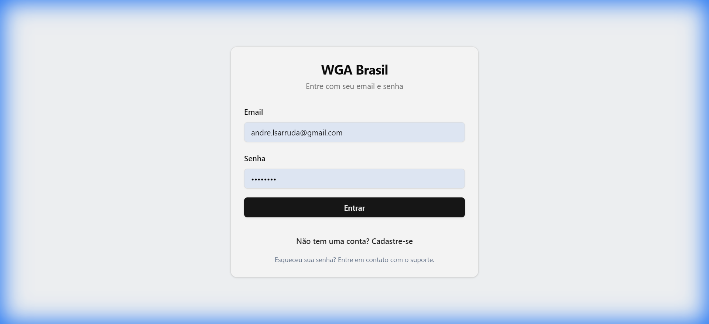

> 💡 Se esqueceu a senha, entre em contato com o administrador.

### Primeiro Acesso

Novos usuários precisam ser aprovados por um administrador antes de acessar o sistema.

---

## 📊 Dashboard

O Dashboard exibe indicadores e estatísticas das visitas.

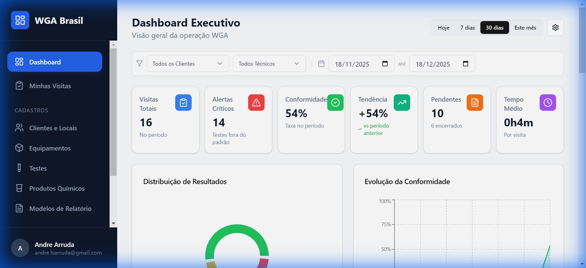

### Filtros Disponíveis

| Filtro | Descrição |
|--------|-----------|
| **Cliente** | Filtra por cliente específico |
| **Técnico** | Filtra por técnico responsável |
| **Período** | Hoje, 7 dias, 30 dias, 90 dias, 6 meses, Ano, ou personalizado |

### Cards de KPIs

- **Total de Visitas** - Quantidade de visitas no período
- **Finalizadas** - Visitas concluídas
- **Pendentes** - Visitas ainda não finalizadas
- **Não Sincronizadas** - Visitas finalizadas mas não enviadas

### Gráficos

- **Evolução Mensal** - Visitas por mês (últimos 6 meses)
- **Status das Visitas** - Pizza/Rosca com distribuição por status
- **Tempo por Visita** - Tempo médio de cada visita

### Ranking de Pontos Críticos

Lista os testes que mais tiveram resultados críticos (fora do padrão).

### Visitas Pendentes

Tabela com visitas que ainda precisam de ação.

### Personalização

Clique no ícone ⚙️ para:
- Mostrar/ocultar widgets
- Reordenar os cards do dashboard

---

## 📋 Visitas Técnicas

### Visualizar Visitas

1. Clique em **Visitas** no menu lateral
2. Use os filtros de data e técnico
3. Clique em uma visita para ver detalhes

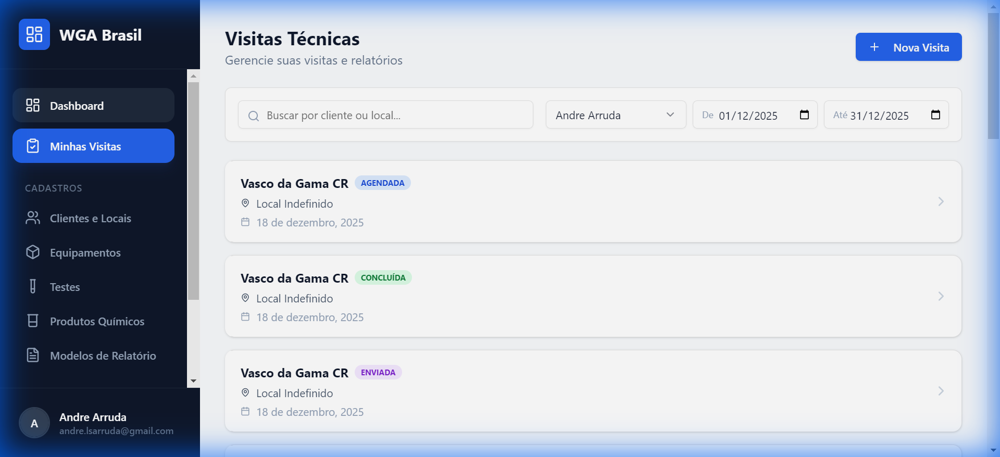

### Criar Nova Visita

1. Clique no botão **+ Nova Visita**
2. Selecione a **Data**
3. Escolha o **Cliente**
4. A visita será criada e você será direcionado aos detalhes

### Status das Visitas

| Status | Cor | Descrição |
|--------|-----|-----------|
| **Agendada** | 🔵 Azul | Visita programada |
| **Em Andamento** | 🟡 Amarelo | Técnico em campo |
| **Concluída** | 🟢 Verde | Finalizada localmente |
| **Enviada** | 🟣 Roxo | Relatório enviado ao cliente |

---

## 🔍 Detalhes da Visita

Cada visita possui 5 abas:

### Aba: Leituras

Registre os resultados dos testes/ensaios por equipamento:

1. Selecione o **Local** (se houver múltiplos)
2. Para cada equipamento, clique para expandir
3. Digite o **valor** de cada teste
4. Observe os indicadores:
   - 🟢 Verde = Dentro da faixa
   - 🟡 Amarelo = Atenção
   - 🔴 Vermelho = Crítico

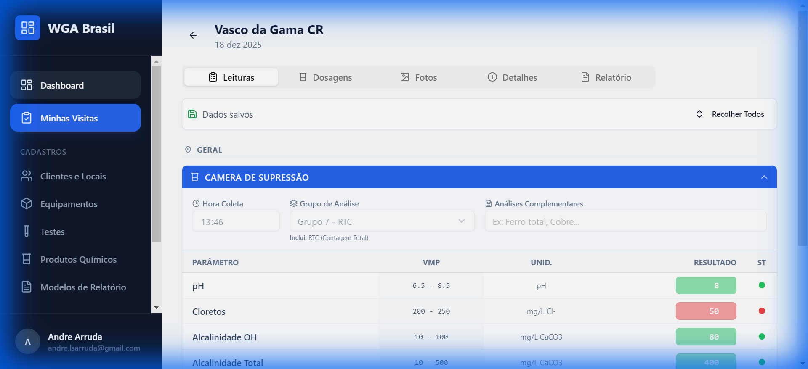

> 💡 Os valores são salvos automaticamente ao sair do campo.

### Aba: Dosagens

Controle os produtos químicos aplicados:

1. Veja os produtos configurados para cada equipamento
2. Digite a **dosagem aplicada** (em ml, g, etc.)
3. O sistema calcula automaticamente o débito no estoque

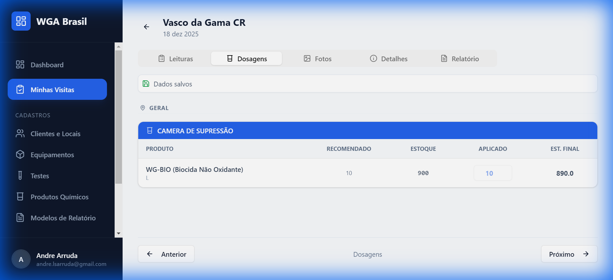

**Funcionalidades:**
- Ver estoque atual do cliente
- Ver dosagem padrão recomendada
- Alertas de estoque baixo

### Aba: Fotos

Registre fotos da visita:

1. Clique em **+ Adicionar Foto**
2. Tire a foto ou selecione da galeria
3. As fotos ficam anexadas à visita

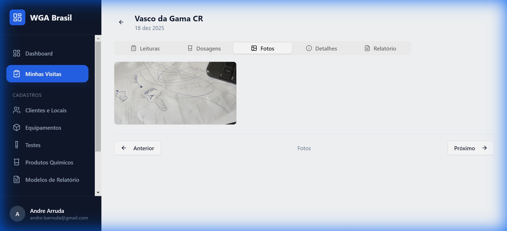

Para excluir: clique no ícone 🗑️ sobre a foto.

### Aba: Detalhes

Informações gerais da visita:
- Cliente
- Local
- Data
- Status
- Técnico responsável


### Aba: Relatório

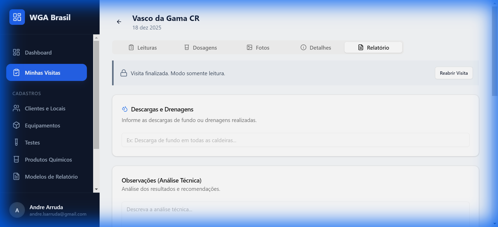

#### Observações

1. **Observações Gerais** - Observações sobre a visita
2. **Descargas e Drenos** - Informações sobre descargas realizadas

> 💡 Use o botão **+ Template** para inserir textos pré-definidos.

#### Gerar Análise com IA

1. Clique em **Gerar Análise IA**
2. A IA analisa os resultados e dosagens
3. Gera uma análise técnica automática
4. O texto é adicionado às observações

#### Assinatura do Cliente

1. Use o quadro de assinatura digital
2. Cliente assina com o dedo ou caneta
3. Clique em **Salvar**

#### Finalizar Visita

**Finalizar Localmente:**
- Clique em **Finalizar Localmente**
- O estoque será debitado
- Status muda para "Concluída"

**Finalizar, Enviar e Salvar:**
- Clique em **Finalizar, Enviar e Salvar**
- Confirme a ação
- O sistema:
  1. Gera o PDF do relatório
  2. Salva no Google Drive do cliente
  3. Envia por email ao cliente
  4. Status muda para "Enviada"

#### Reabrir Visita

Se precisar corrigir algo:
1. Clique em **Reabrir Visita**
2. O estoque será estornado
3. Faça as correções
4. Finalize novamente

### Navegação entre Abas

Use os botões **< Anterior** e **Próximo >** no final da página para navegar sem precisar rolar até o topo.

---

## 👥 Clientes

### Cadastrar Cliente

1. Vá em **Cadastros** > **Clientes**
2. Clique em **+ Novo Cliente**
3. Preencha:
   - **Nome** (obrigatório)
   - **CNPJ**
   - **Endereço**
   - **Telefone**
   - **Email** (para receber relatórios)
   - **ID da Pasta do Drive** (para salvar PDFs)
   - **Descargas Padrão** (texto automático no relatório)

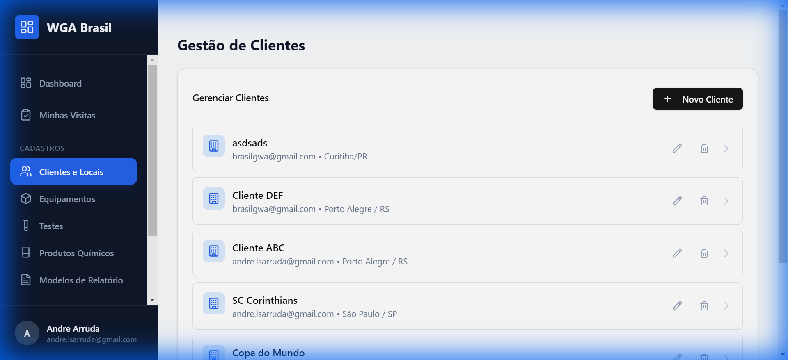

### Gerenciar Locais

Cada cliente pode ter múltiplos locais (filiais, torres, etc.):

1. Clique no cliente
2. Clique em **+ Adicionar Local**
3. Preencha o nome do local

### Configurar Equipamentos por Local

1. Selecione o local
2. Clique em **+ Adicionar Equipamento**
3. Escolha o tipo de equipamento
4. Configure os testes que serão realizados
5. Configure os produtos que serão dosados

---

## ⚙️ Equipamentos

### Tipos de Equipamentos

1. Vá em **Cadastros** > **Equipamentos**
2. Cadastre tipos como:
   - Torre de Resfriamento
   - Caldeira
   - Chiller
   - ETA/ETE
   - etc.

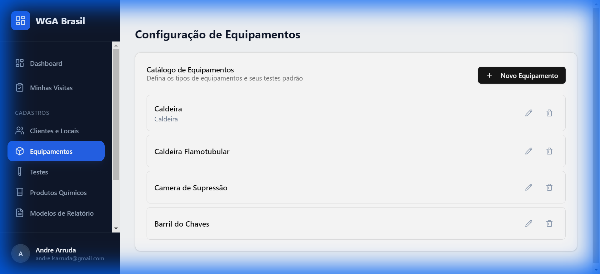

### Configuração

Para cada tipo de equipamento, defina:
- Nome e descrição
- Ícone (opcional)
- Testes padrão associados
- Produtos padrão configurados

---

## 🧪 Testes/Ensaios

### Cadastrar Teste

1. Vá em **Cadastros** > **Testes**
2. Clique em **+ Novo Teste**
3. Preencha:
   - **Nome** (ex: pH, Condutividade, Cloro Livre)
   - **Unidade** (ex: pH, µS/cm, ppm)
   - **Faixa Mínima** (valor ideal mínimo)
   - **Faixa Máxima** (valor ideal máximo)
   - **Limite Crítico Inferior** (abaixo = vermelho)
   - **Limite Crítico Superior** (acima = vermelho)

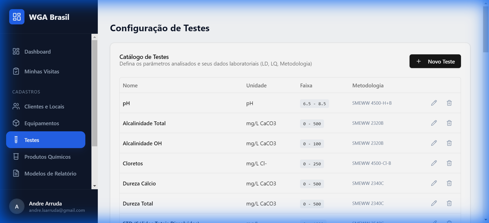

### Indicadores de Cor

| Resultado | Condição |
|-----------|----------|
| 🟢 Verde | Dentro da faixa min-max |
| 🟡 Amarelo | Entre faixa e limite crítico |
| 🔴 Vermelho | Fora do limite crítico |

---

## 🧴 Produtos

### Cadastrar Produto

1. Vá em **Cadastros** > **Produtos**
2. Clique em **+ Novo Produto**
3. Preencha:
   - **Nome** (ex: Biocida XYZ)
   - **Unidade** (ex: litros, kg)
   - **Descrição**

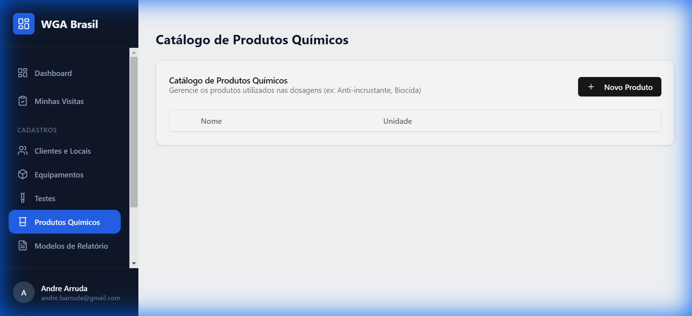

### Estoque por Cliente

O estoque é gerenciado por cliente:
- Cada cliente tem seu próprio estoque
- As dosagens aplicadas são debitadas automaticamente
- Alertas aparecem quando estoque está baixo

---

## 📝 Templates de Observação

### Criar Template

1. Vá em **Cadastros** > **Templates**
2. Clique em **+ Novo Template**
3. Preencha:
   - **Nome** (como aparece na lista)
   - **Conteúdo** (texto que será inserido)

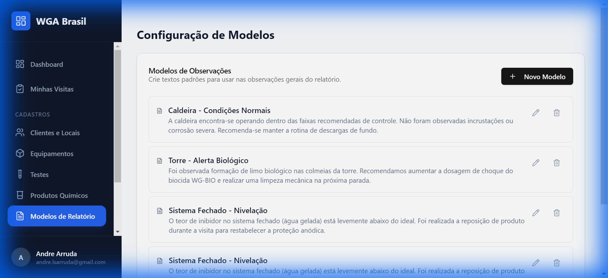

### Usar Template

Na aba Relatório da visita:
1. Clique no botão **+ Template**
2. Escolha o template desejado
3. O texto é inserido no campo de observações

---

## 🤖 Configuração de IA

### Acessar

1. Vá em **Cadastros** > **IA**

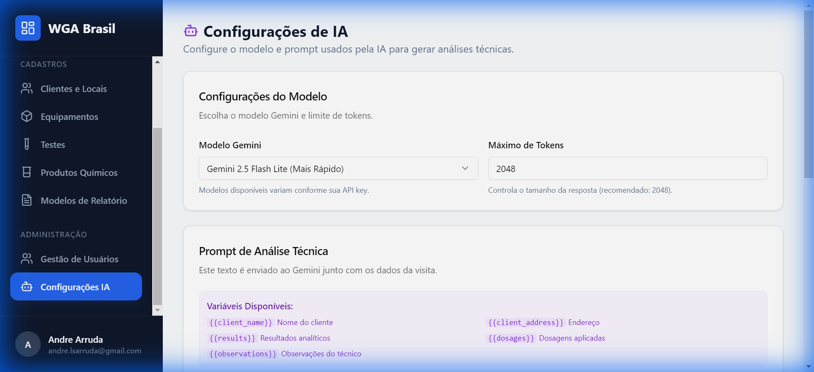

### Configurações

| Campo | Descrição |
|-------|-----------|
| **Modelo Gemini** | Escolha o modelo de IA (Flash, Lite, etc.) |
| **Máximo de Tokens** | Limite o tamanho da resposta |
| **Prompt** | Texto enviado à IA junto com os dados |

### Variáveis no Prompt

Use estas variáveis que serão substituídas automaticamente:

| Variável | Substituído Por |
|----------|-----------------|
| `{{client_name}}` | Nome do cliente |
| `{{client_address}}` | Endereço |
| `{{results}}` | Resultados dos testes |
| `{{dosages}}` | Dosagens aplicadas |
| `{{observations}}` | Observações do técnico |

### Restaurar Padrão

Clique em **Restaurar Padrão** para usar o prompt original.

---

## 👤 Gerenciamento de Usuários

> ⚠️ Apenas administradores têm acesso.

### Visualizar Usuários

1. Vá em **Usuários** no menu
2. Veja a lista de todos os usuários

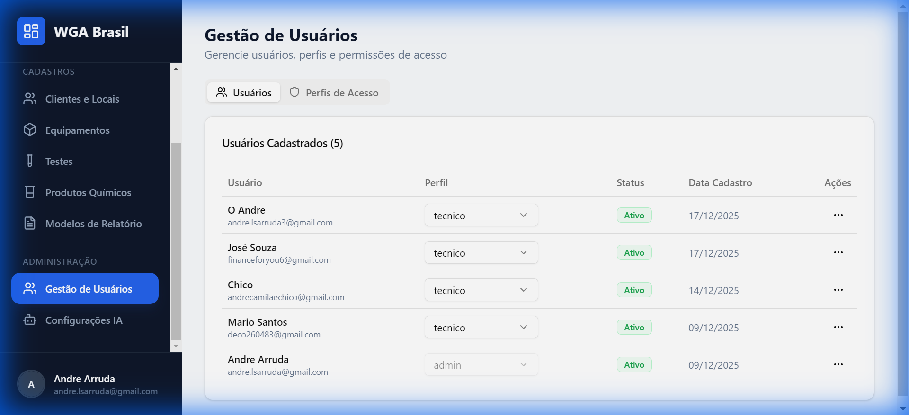

### Alterar Perfil de Acesso

1. Encontre o usuário
2. No dropdown de perfil, selecione:
   - **Admin** - Acesso total
   - **Gerente** - Acesso intermediário
   - **Técnico** - Acesso básico
3. Confirme a alteração

### Ativar/Desativar Usuário

1. Clique no ícone de menu (⋮)
2. Escolha **Ativar** ou **Desativar**
3. Usuários desativados não conseguem fazer login

### Gerenciar Perfis (RBAC)

Na aba **Perfis de Acesso**:
1. Veja os perfis existentes
2. Edite permissões de cada perfil
3. Crie novos perfis se necessário

---

## 👤 Meu Perfil

### Acessar

1. Clique no seu nome no canto inferior da sidebar
2. Clique em **Meu Perfil**

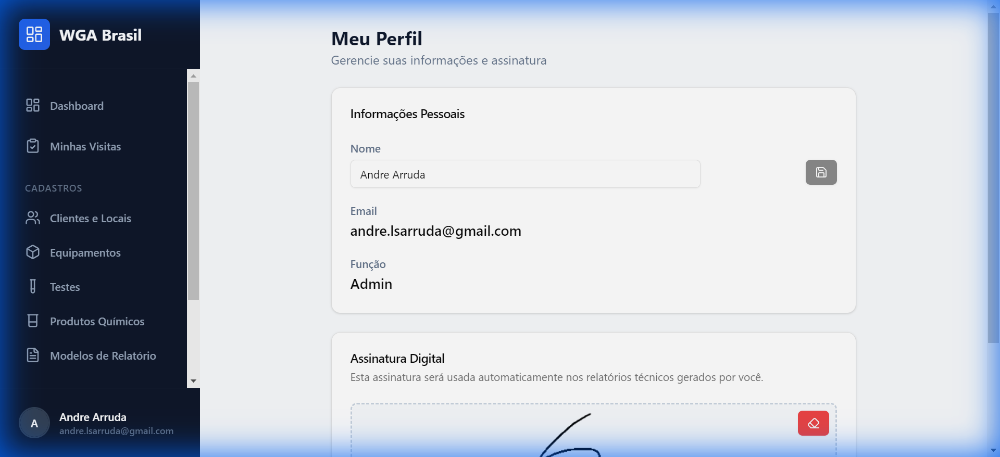

### Alterar Nome

1. Digite seu nome completo
2. Clique em **Salvar**

### Cadastrar Assinatura

A assinatura aparece nos relatórios:

1. Desenhe sua assinatura no quadro
2. Clique em **Salvar**

> 💡 Se não tiver assinatura cadastrada, o sistema pedirá antes de finalizar relatórios.

---

## 📱 Uso Offline (PWA)

O sistema funciona como um aplicativo:

### Instalar no Celular

1. Acesse `https://gwaapp.vercel.app` no navegador
2. Clique em **"Adicionar à tela inicial"** (ou instalar)
3. O app fica disponível como ícone

### Funcionalidades Offline

- Visualizar visitas recentes
- Preencher leituras (sincroniza depois)
- Tirar fotos

---

## ❓ Dúvidas Frequentes

### Por que o estoque não atualizou?

O estoque só é debitado ao clicar em **Finalizar Localmente** ou **Finalizar, Enviar e Salvar**.

### Como reenviar um relatório?

Mesmo visitas "Enviadas" podem ser reenviadas:
1. Abra a visita
2. Vá na aba Relatório
3. Clique em **Reenviar e Salvar no Drive**

### Por que não consigo acessar certa página?

Seu perfil de acesso pode não ter permissão. Fale com o administrador.

### As fotos não estão salvando?

Verifique sua conexão com a internet e tente novamente.

---

## 📞 Suporte

Em caso de problemas, entre em contato com o administrador do sistema.

---

*Manual do Usuário - WGA Brasil*
*Versão 1.3.0 | Dezembro 2024*
