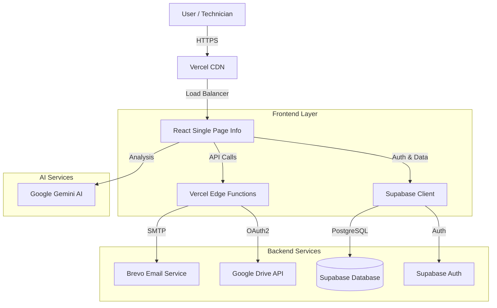
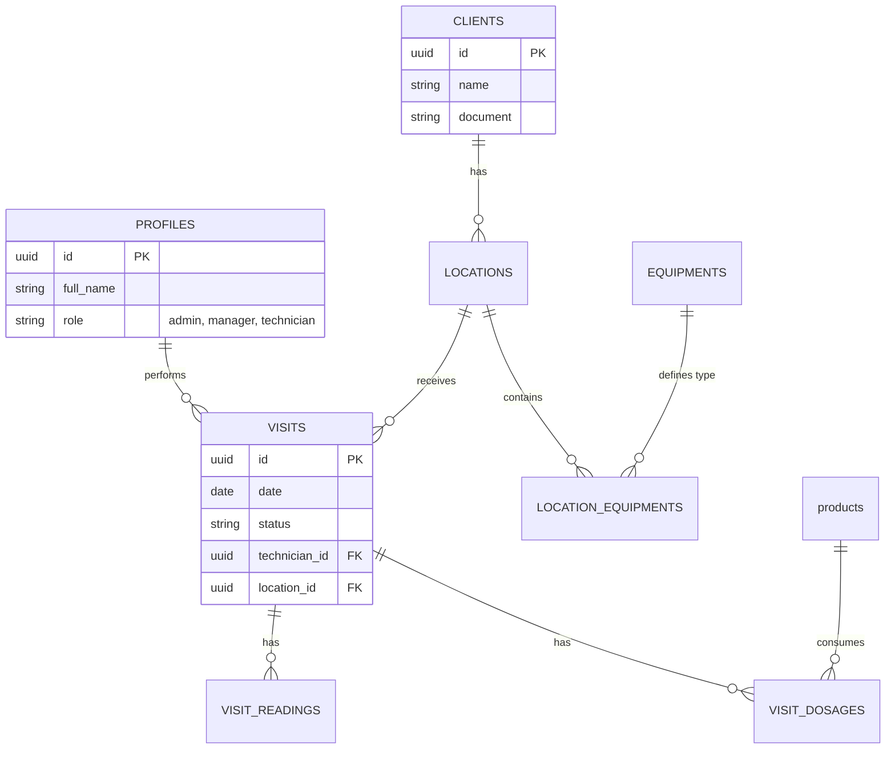

# 🏗️ WGA Brasil - Architecture Documentation

## System Overview

The WGA Brasil application is a Technical Visit Management System designed for water treatment companies. It allows technicians to register visits, control chemical dosages, and generate automated reports.

### High-Level Architecture



## 🧩 Component Architecture

### Frontend (`src/`)
- **Technologies**: React, Vite, TailwindCSS, shadcn/ui.
- **State Management**: React Context (`AuthContext`, `ConfirmContext`).
- **Routing**: React Router.
- **PWA**: Configured for offline usage (manifest.json, service workers).

### Serverless Functions (`api/`)
Hosted on Vercel as Edge Functions.
- `/api/send-email`: Handles transactional emails using Nodemailer and Brevo SMTP.
- `/api/upload-drive`: Manages PDF upload to Google Drive using Google APIs.

### Database (`Supabase`)
- **PostgreSQL**: Primary data store.
- **RLS (Row Level Security)**: strict security policies based on user roles (`admin`, `manager`, `technician`).
- **Realtime**: Enabled for critical tables.

## 🗄️ Database Schema



## 🔒 Security & Permissions (RBAC)

Access control is enforced via Supabase RLS and Frontend Route Guards.

| Role | Description | Access Scope |
|------|-------------|--------------|
| **Admin** | System Administrator | Full access to all resources and settings. |
| **Manager** | Operational Manager | Manage clients, technicians, and view all visits. |
| **Technician** | Field Technician | Manage own visits and view assigned clients. |

### Protected Routes
- `/dashboard`: All authenticated users (content varies by role).
- `/settings/*`: Admin only.
- `/visits`: All roles (RLS filters data).

## 📁 Project Structure

```
wga-brasil/
├── api/                    # Serverless Functions (Vercel)
├── src/
│   ├── api/                # Supabase Data Access Layer
│   ├── components/         # React Components
│   │   ├── ui/             # Reusable UI elements
│   │   ├── visit/          # Visit-specific components
│   ├── context/            # Global State (Auth, UI)
│   ├── lib/                # Utilities (Supabase client, Helpers)
│   └── pages/              # Application Routes
└── public/                 # Static Assets
```

