# 📱 WGA Brasil - User Guide

> **Technical Visit Management System**
> Version 1.0.25

---

## 📑 Index

1. [Introduction](#introduction)
2. [First Use & Initial Setup](#first-use--initial-setup)
3. [System Access](#system-access)
4. [Dashboard](#dashboard)
5. [Technical Visits](#technical-visits)
6. [Visit Details](#visit-details)
7. [Clients](#clients)
8. [Equipments](#equipments)
9. [Tests/Analyses](#testsanalyses)
10. [Products](#products)
11. [Observation Templates](#observation-templates)
12. [AI Configuration](#ai-configuration)
13. [AI Assistant (Chatbot)](#ai-assistant-chatbot)
14. [User Management](#user-management)
15. [My Profile](#my-profile)

---

## 📖 Introduction

**WGA Brasil** is a complete system for managing water treatment technical visits. It allows you to:

- ✅ Register visits and readings in the field
- ✅ Control chemical product dosages
- ✅ Take and attach photos
- ✅ Generate automated reports with AI
- ✅ Send reports via email
- ✅ Save reports to Google Drive
- ✅ Manage product stock per client

---

## 🚀 First Use & Initial Setup

> ⚠️ **Important:** The system has functional dependencies between registrations. Follow the order below to avoid problems.

### Configuration Order

For the system to work correctly, registrations must be done in **this order**:

```
┌─────────────────────────────────────────────────────────────────┐
│  1. TESTS           →  Define the assays/analyses to be performed│
│                        (pH, Chlorine, Conductivity...)          │
├─────────────────────────────────────────────────────────────────┤
│  2. PRODUCTS        →  Register chemical products to be dosed   │
│                        (Biocide, Antiscalant...)                │
├─────────────────────────────────────────────────────────────────┤
│  3. EQUIPMENTS      →  Create equipment types and associate     │
│                        standard tests and products              │
├─────────────────────────────────────────────────────────────────┤
│  4. CLIENTS         →  Register clients                         │
├─────────────────────────────────────────────────────────────────┤
│  5. LOCATIONS       →  Create locations/units within the client │
├─────────────────────────────────────────────────────────────────┤
│  6. EQUIPMENTS      →  Add equipment to each client location    │
│     IN LOCATION                                                 │
├─────────────────────────────────────────────────────────────────┤
│  7. VISITS          →  Now you can create technical visits!     │
└─────────────────────────────────────────────────────────────────┘
```

### Functional Dependencies

| To do... | You must first have... |
|----------|------------------------|
| Register **readings** in a visit | Equipment with associated tests in the location |
| Register **dosages** in a visit | Equipment with associated products in the location |
| Create **visit** for a client | Client with at least one registered location |
| Add **equipment** to location | Registered equipment type |
| Associate **test** to equipment | Test registered in Registers > Tests |
| Associate **product** to equipment | Product registered in Registers > Products |
| Control client **stock** | Product registered and added to client stock |

### Quick Guide: First Configuration

**Step 1:** Register Tests
1. Go to **Registers** > **Tests**
2. Register tests you perform (e.g., pH, Conductivity, Free Chlorine)
3. Define ideal ranges and critical limits

**Step 2:** Register Products
1. Go to **Registers** > **Products**
2. Register chemical products (e.g., Biocide, Antiscalant)

**Step 3:** Create Equipment Types
1. Go to **Registers** > **Equipments**
2. Create types like "Cooling Tower", "Boiler"
3. Associate standard tests and products to each type

**Step 4:** Register Client
1. Go to **Registers** > **Clients**
2. Add the client with name, email, phone

**Step 5:** Create Location in Client
1. Inside the client, click **+ Add Location**
2. Give a name (e.g., "HQ", "Tower 1")

**Step 6:** Add Equipment to Location
1. Select the client location
2. Click **+ Add Equipment**
3. Choose the type (tests/products will be inherited)
4. Customize tests/products if necessary

**Step 7:** Ready! Create Visit
1. Go to **Visits** > **+ New Visit**
2. Select client and date
3. Equipments and tests will appear automatically

> 💡 **Tip:** If tests or dosages don't appear in a visit, check if the location's equipment has associated tests/products.

---

## 🔐 System Access

### Login

1. Access `https://gwaapp.vercel.app`
2. Enter your **Email** and **Password**
3. Click **Enter**

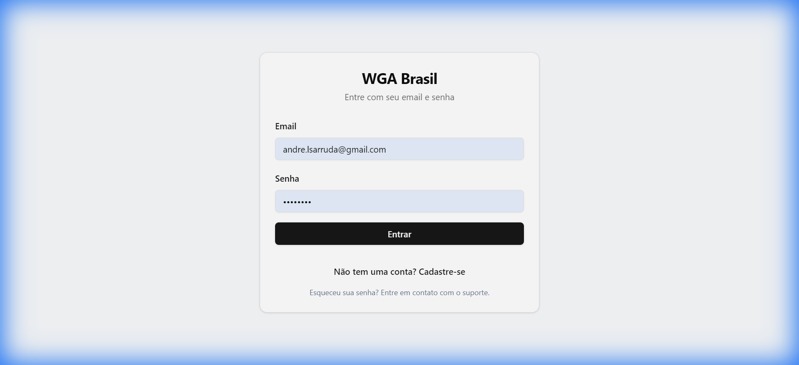

> 💡 If you forgot the password, contact the administrator.

### First Access

New users need approval from an administrator before accessing the system.

---

## 📊 Dashboard

The Dashboard displays indicators and visit statistics.

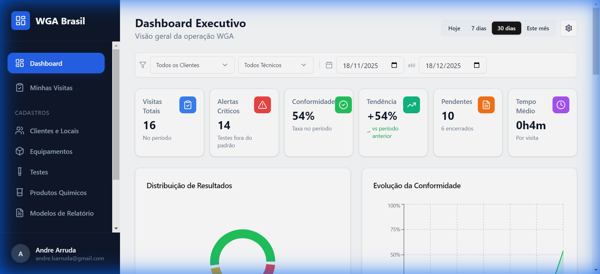

### Available Filters

| Filter | Description |
|--------|-------------|
| **Client** | Filter by specific client |
| **Technician** | Filter by responsible technician |
| **Period** | Today, 7 days, 30 days, 90 days, 6 months, Year, or custom |

### KPI Cards

- **Total Visits** - Number of visits in the period
- **Finished** - Completed visits
- **Pending** - Visits not yet finished
- **Not Synced** - Finished visits but not sent

### Charts

- **Monthly Evolution** - Visits per month (last 6 months)
- **Visit Status** - Pie/Donut chart with distribution by status
- **Time per Visit** - Average time of each visit

### Critical Points Ranking

Lists tests that had the most critical results (out of standard).

### Pending Visits

Table with visits that still need action.

### Customization

Click the ⚙️ icon to:
- Show/hide widgets
- Reorder dashboard cards

---

## 📋 Technical Visits

### View Visits

1. Click **Visits** in the sidebar
2. Use date and technician filters
3. Click a visit to see details

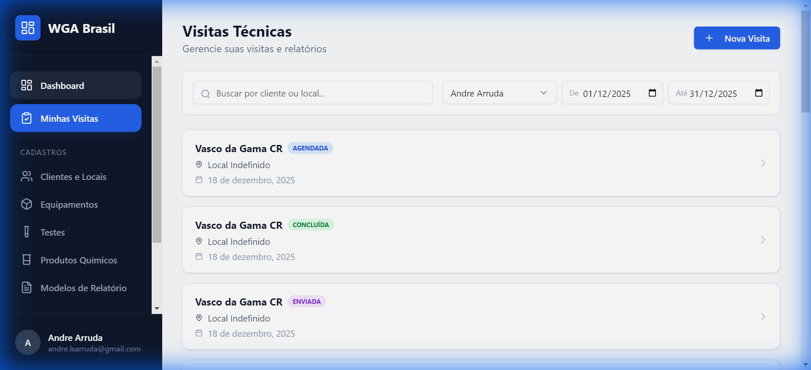

### Create New Visit

1. Click **+ New Visit** button
2. Select **Date**
3. Choose **Client**
4. Visit will be created and you will be redirected to details

### Visit Status

| Status | Color | Description |
|--------|-------|-------------|
| **Scheduled** | 🔵 Blue | Programmed visit |
| **In Progress** | 🟡 Yellow | Technician in field |
| **Completed** | 🟢 Green | Finished locally |
| **Sent** | 🟣 Purple | Report sent to client |

---

## 🔍 Visit Details

Each visit has 5 tabs:

### Tab: Readings

Register test/assay results per equipment:

1. Select **Location** (if multiple)
2. For each equipment, click to expand
3. Enter **value** of each test
4. Observe indicators:
   - 🟢 Green = Within range
   - 🟡 Yellow = Warning
   - 🔴 Red = Critical

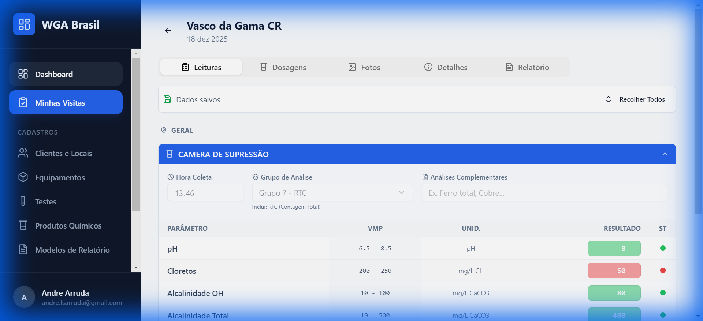

> 💡 Values are saved automatically when leaving the field.

### Tab: Dosages

Control chemical products applied:

1. See configured products for each equipment
2. Enter **applied dosage** (in ml, g, etc.)
3. System automatically calculates stock debit

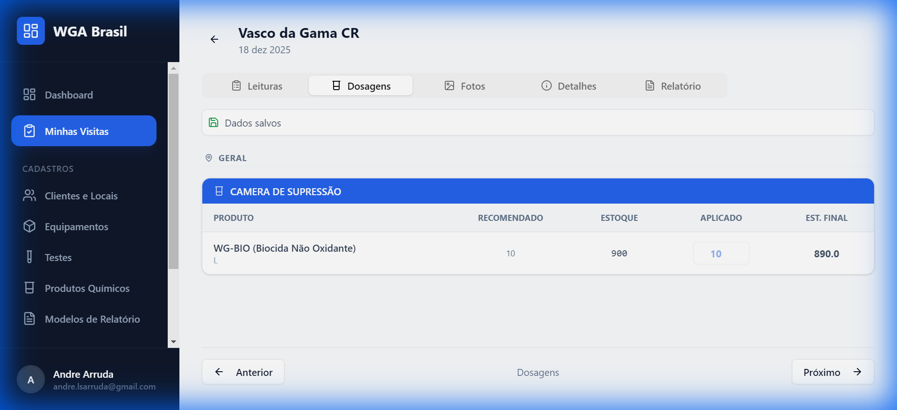

**Features:**
- See current client stock
- See recommended standard dosage
- Low stock alerts

### Tab: Photos

Register visit photos:

1. Click **+ Add Photo**
2. Take photo or select from gallery
3. Photos are attached to the visit

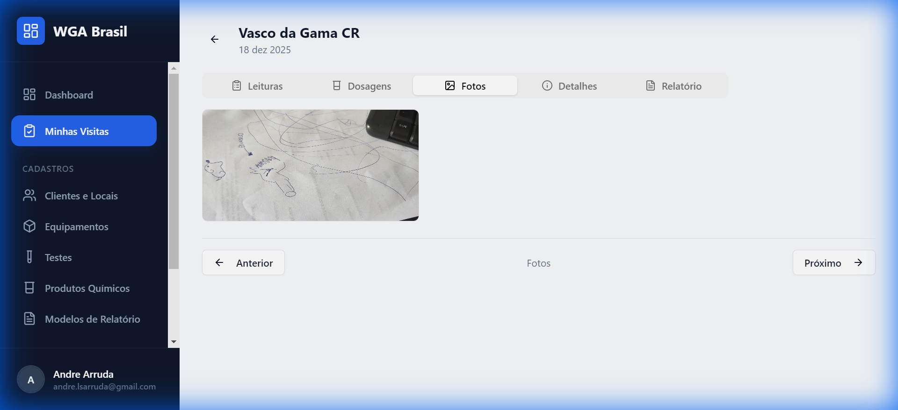

To delete: click 🗑️ icon over the photo.

### Tab: Details

General visit information:
- Client
- Location
- Date
- Status
- Responsible Technician

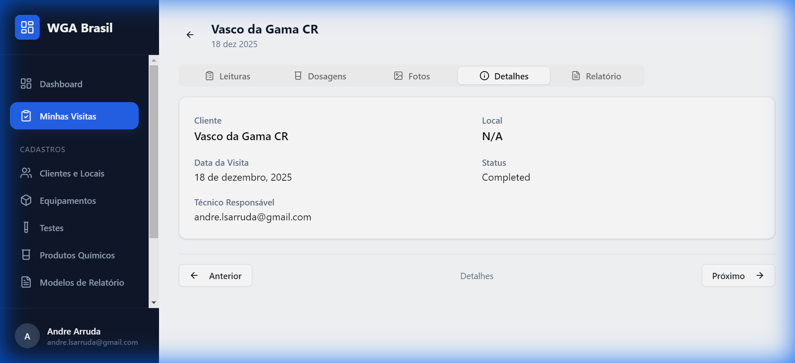

### Tab: Report

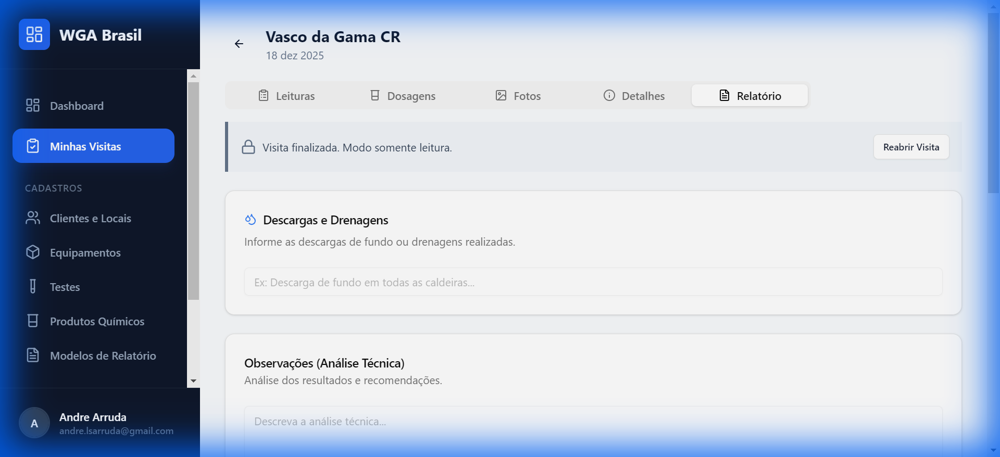

#### Observations

1. **General Observations** - Observations about the visit
2. **Discharges and Drains** - Information about performed discharges

> 💡 Use **+ Template** button to insert predefined texts.

#### Generate AI Analysis

1. Click **Generate AI Analysis**
2. AI analyzes results and dosages
3. Generates automatic technical analysis
4. Text is added to observations

#### Client Signature

1. Use digital signature pad
2. Client signs with finger or pen
3. Click **Save**

#### Finish Visit

**Finish Locally:**
- Click **Finish Locally**
- Stock will be debited
- Status changes to "Completed"

**Finish, Send and Save:**
- Click **Finish, Send and Save**
- Confirm action
- System:
  1. Generates PDF report
  2. Saves to Client's Google Drive
  3. Sends via email to client
  4. Status changes to "Sent"

#### Reopen Visit

If corrections are needed:
1. Click **Reopen Visit**
2. Stock will be reversed
3. Make corrections
4. Finish again

### Navigation between Tabs

Use **< Previous** and **Next >** buttons at the bottom of the page to navigate without scrolling to top.

---

## 👥 Clients

### Register Client

1. Go to **Registers** > **Clients**
2. Click **+ New Client**
3. Fill in:
   - **Name** (required)
   - **CNPJ** (Tax ID)
   - **Address**
   - **Phone**
   - **Email** (to receive reports)
   - **Drive Folder ID** (to save PDFs)
   - **Standard Discharges** (automatic text in report)

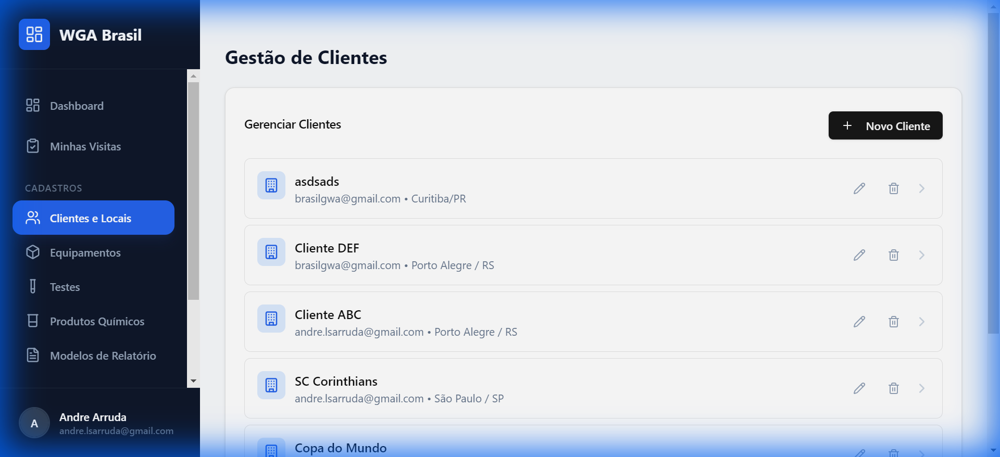

### Manage Locations

Each client can have multiple locations (branches, towers, etc.):

1. Click the client
2. Click **+ Add Location**
3. Fill in location name

### Configure Equipment per Location

1. Select location
2. Click **+ Add Equipment**
3. Choose equipment type
4. Configure tests to be performed
5. Configure products to be dosed

---

## ⚙️ Equipments

### Equipment Types

1. Go to **Registers** > **Equipments**
2. Register types like:
   - Cooling Tower
   - Boiler
   - Chiller
   - WTP/WWTP
   - etc.

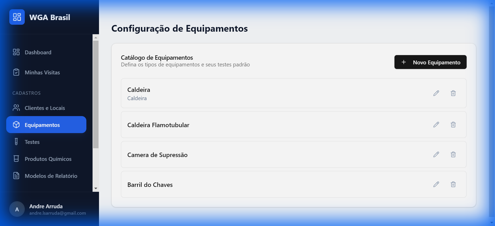

### Configuration

For each equipment type, define:
- Name and description
- Icon (optional)
- Standard associated tests
- Standard configured products

---

## 🧪 Tests/Assays

### Register Test

1. Go to **Registers** > **Tests**
2. Click **+ New Test**
3. Fill in:
   - **Name** (e.g., pH, Conductivity, Free Chlorine)
   - **Unit** (e.g., pH, µS/cm, ppm)
   - **Min Range** (ideal minimum value)
   - **Max Range** (ideal maximum value)
   - **Lower Critical Limit** (below = red)
   - **Upper Critical Limit** (above = red)

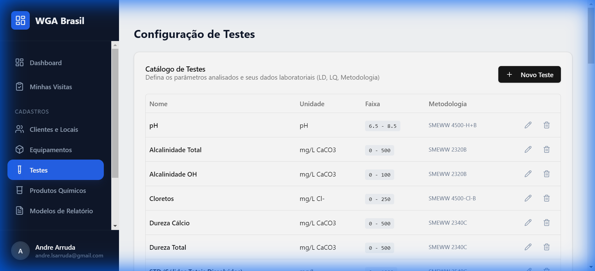

### Color Indicators

| Result | Condition |
|--------|-----------|
| 🟢 Green | Within min-max range |
| 🟡 Yellow | Between range and critical limit |
| 🔴 Red | Outside critical limit |

---

## 🧴 Products

### Register Product

1. Go to **Registers** > **Products**
2. Click **+ New Product**
3. Fill in:
   - **Name** (e.g., Biocide XYZ)
   - **Unit** (e.g., liters, kg)
   - **Description**

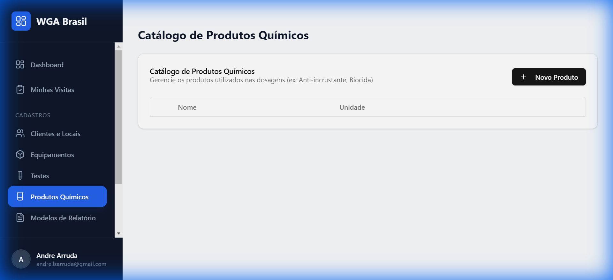

### Stock per Client

Stock is managed per client:
- Each client has their own stock
- Applied dosages are automatically debited
- Alerts appear when stock is low

---

## 📝 Observation Templates

### Create Template

1. Go to **Registers** > **Templates**
2. Click **+ New Template**
3. Fill in:
   - **Name** (as appears in list)
   - **Content** (text to be inserted)

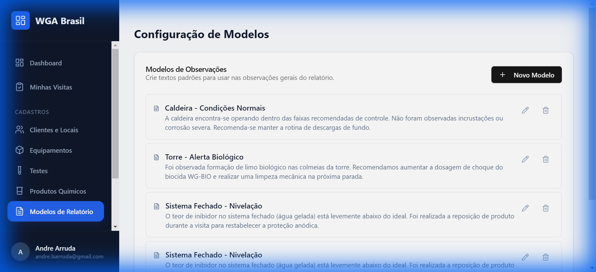

### Use Template

In Visit Report tab:
1. Click **+ Template** button
2. Choose desired template
3. Text is inserted into observations field

---

## 🤖 AI Configuration

### Access

1. Go to **Registers** > **AI**

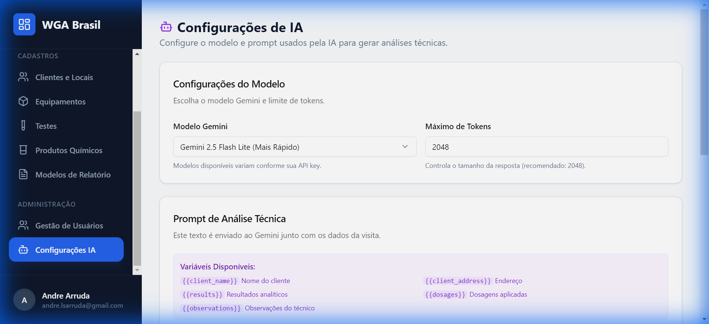

### Settings

| Field | Description |
|-------|-------------|
| **Gemini Model** | Choose AI model (Flash, Lite, etc.) |
| **Max Tokens** | Limit response size |
| **Prompt** | Text sent to AI along with data |

### Prompt Variables

Use these variables which will be automatically replaced:

| Variable | Replaced By |
|----------|-------------|
| `{{client_name}}` | Client name |
| `{{client_address}}` | Address |
| `{{results}}` | Test results |
| `{{dosages}}` | Applied dosages |
| `{{observations}}` | Technician observations |

### Restore Default

Click **Restore Default** to use the original prompt.

---

## 🤖 AI Assistant (Chatbot)

The AI Assistant is an interactive tool to answer technical questions about water treatment and the WGA system.

### How to Access

1. Click **Chat** or **Assistant** icon in sidebar.
2. Or use "Chat" button available on Dashboard.

### Features

- **Technical Questions**: Ask about analysis parameters, chemical products, and procedures.
- **Visit Context**: If accessed from a visit, assistant knows results and can help with interpretation.
- **Scope**: Assistant responds exclusively about water treatment, effluents, and WGA services.

> 💡 The assistant uses WGA's technical knowledge base to provide accurate answers.

---

## 👤 User Management

> ⚠️ Only administrators have access.

### View Users

1. Go to **Users** in menu
2. See list of all users

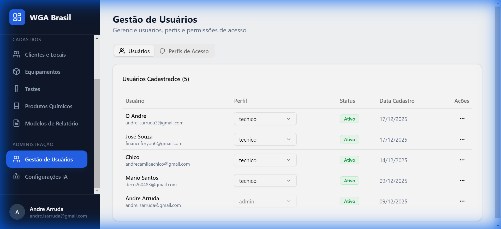

### Change Access Profile

1. Find user
2. In profile dropdown, select:
   - **Admin** - Full access
   - **Manager** - Intermediate access
   - **Technician** - Basic access
3. Confirm change

### Activate/Deactivate User

1. Click menu icon (⋮)
2. Choose **Activate** or **Deactivate**
3. Deactivated users cannot log in

### Manage Profiles (RBAC)

In **Access Profiles** tab:
1. See existing profiles
2. Edit permissions for each profile
3. Create new profiles if necessary

---

## 👤 My Profile

### Access

1. Click your name at bottom of sidebar
2. Click **My Profile**

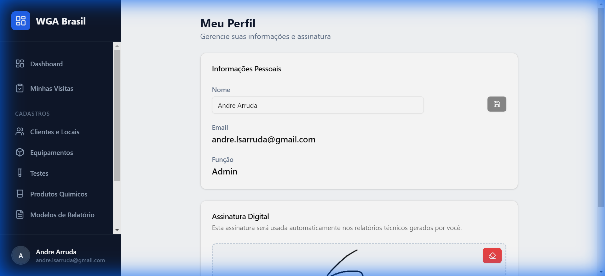

### Change Name

1. Enter your full name
2. Click **Save**

### Register Signature

Signature appears on reports:

1. Draw your signature in the box
2. Click **Save**

> 💡 If no signature is registered, system will ask before finishing reports.

---

## 📱 Offline Use (PWA)

The system works as an app:

### Install on Mobile

1. Access `https://gwaapp.vercel.app` in browser
2. Click **"Add to Home Screen"** (or install)
3. App becomes available as an icon

### Offline Features

- View recent visits
- Fill readings (syncs later)
- Take photos

---

## ❓ FAQ

### Why didn't the stock update?

Stock is only debited when clicking **Finish Locally** or **Finish, Send and Save**.

### How to resend a report?

Even "Sent" visits can be resent:
1. Open visit
2. Go to Report tab
3. Click **Resend and Save to Drive**

### Why can't I access a certain page?

Your access profile might not have permission. Talk to administrator.

### Photos not saving?

Check your internet connection and try again.

---

## 📞 Support

In case of problems, contact system administrator.

---

*User Guide - WGA Brasil*
*Version 1.0.25 | January 2026*

